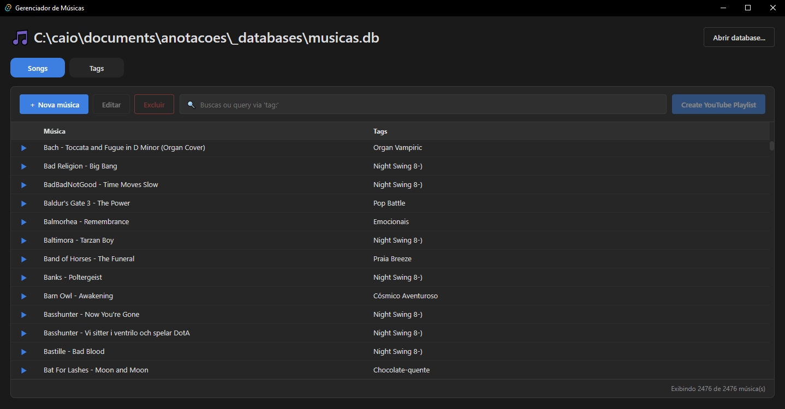

# Gerenciador de Músicas



## Prerequisites

- [Bun](https://bun.sh) >= X
- Rust (stable, >= X) via [rustup](https://rustup.rs)
- Tauri's system dependencies for your OS: [Tauri Prerequisites](https://v2.tauri.app/start/prerequisites/)
  


## Installation

```sh
bun install
    # Resolves package.json, reuses bun.lock where possible, and rewrites bun.lock if anything doesn't match
bun install --frozen-lockfile
    # Install exactly what bun.lock says, and fail if the lockfile and package.json disagree, instead of quietly updating the lockfile.
```

##### List of dependencies
- All JS/TS dependencies are listed in `package.json`.
    - Exact versions are list in `bun.lock`.
- All Rust dependencies are listed in `src-tauri/Cargo.toml`.
    - Exact versions are list in `src-tauri/Cargo.lock`.


## Development

```sh
bun run tauri:dev     # app with hot reload
bun run check         # type-check
bun run check:watch   # type-check in watch mode
```


## Build


### For desktop

```sh
bun run tauri:build
```
- Output: `builds/tauri`.


### For browser

```sh
bun run build
bunx serve builds/web
```
- Output: `builds/web`.


## License

MIT, see `LICENSE`.
